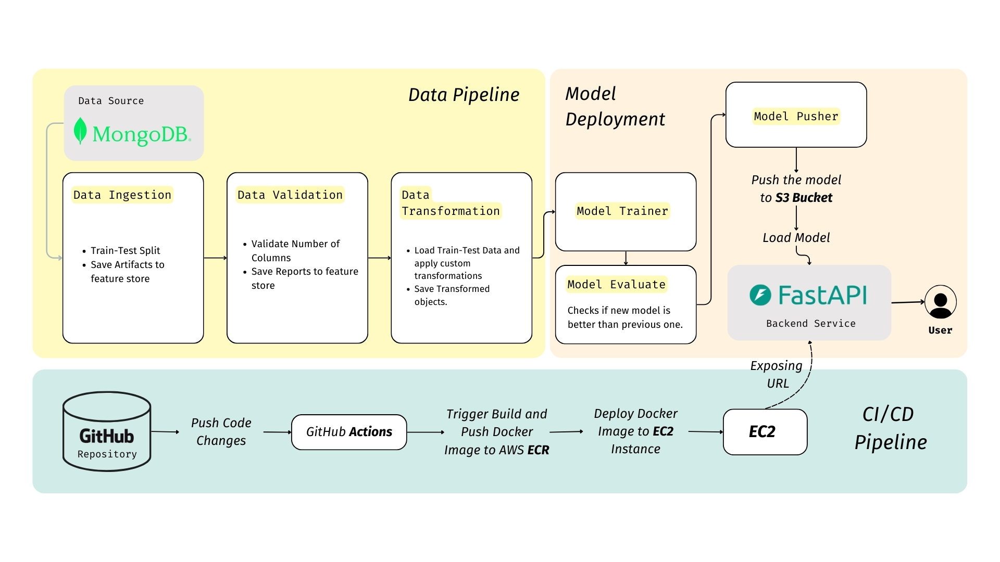
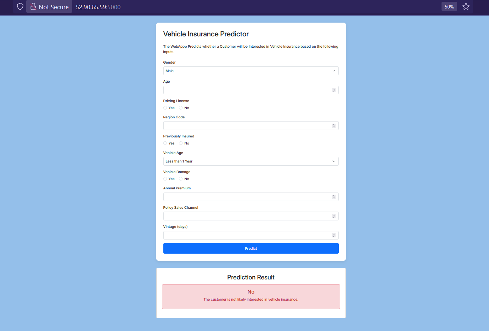

# MLOps Project - Vehicle Insurance Data Pipeline

This project predicts whether a customer will be interested in purchasing Vehicle Insurance. It is an end-to-end machine learning solution, including data ingestion, model training, deployment, and a user-friendly web interface equipped with robust CI/CD Automation!


---
### Table of Contents
1. [Introduction](#introduction)
2. [Features](#features)
3. [Tools and Technologies](#️-tools-and-technologies)
4. [Project Structure](#project-structure)
5. [Project Setup](#-project-setup)
6. [UI Screenshot](#-project-screenshot)
7. [Additional Resources](#️-additional-resources)
8. [Contact](#-connect)

---
## Introduction
The goal of this project is to help insurance companies identify potential customers who are likely to purchase vehicle insurance. It involves:

- Data ingestion from MongoDB.

- Data validation, transformation, and model training.

- Deployment of the model using FastAPI and Docker.

- A web interface for users to input data and view predictions.
 ---
## 💫 Features
- End-to-End Machine Learning Pipeline:

  - Data ingestion, validation, transformation, model training, and evaluation.

- Robust Logging and Exception Handling.

- FastAPI Backend:

  - Real-time predictions using a trained machine learning model.

- Dockerized Application:

  - Easy deployment and scalability.

- CI/CD Pipeline:

  - Automated testing, building, and deployment using GitHub Actions.

- User-Friendly Web Interface:


  - Built with HTML and Bootstrap.
---
## 🖥️ **Tools and Technologies**
- **Programming Languages**: Python.
- **Frameworks and Libraries**: FastAPI, Scikit-learn, Pandas, NumPy.
- **Database**: MongoDB.
- **Cloud Services**: AWS S3, AWS ECR, AWS EC2.
- **DevOps**: Docker, GitHub Actions.
- **Frontend**: HTML, Tailwind CSS.
---
## **Project Structure**
```
Directory structure:
└── satvikx-mlops-vehicle-insurance/
    ├── README.md
    ├── Dockerfile
    ├── LICENSE
    ├── app.py
    ├── pyproject.toml
    ├── requirements.txt
    ├── setup.py
    ├── template.py
    ├── .dockerignore
    ├── config/
    │   ├── model.yaml
    │   └── schema.yaml
    ├── src/
    │   ├── __init__.py
    │   ├── cloud_storage/
    │   │   ├── __init__.py
    │   │   └── aws_storage.py
    │   ├── components/
    │   │   ├── __init__.py
    │   │   ├── data_ingestion.py
    │   │   ├── data_transformation.py
    │   │   ├── data_validation.py
    │   │   ├── model_evaluation.py
    │   │   ├── model_pusher.py
    │   │   └── model_trainer.py
    │   ├── configuration/
    │   │   ├── __init__.py
    │   │   ├── aws_connection.py
    │   │   └── mongo_db_connection.py
    │   ├── constants/
    │   │   └── __init__.py
    │   ├── data_access/
    │   │   ├── __init__.py
    │   │   └── proj1_data.py
    │   ├── entity/
    │   │   ├── __init__.py
    │   │   ├── artifact_entity.py
    │   │   ├── config_entity.py
    │   │   ├── estimator.py
    │   │   └── s3_estimator.py
    │   ├── exception/
    │   │   └── __init__.py
    │   ├── logger/
    │   │   └── __init__.py
    │   ├── pipline/
    │   │   ├── __init__.py
    │   │   ├── prediction_pipeline.py
    │   │   └── training_pipeline.py
    │   └── utils/
    │       ├── __init__.py
    │       └── main_utils.py
    ├── static/
    │   └── css/
    │       └── style.css
    ├── templates/
    │   └── vehicle.html
    └── .github/
        └── workflows/
            └── aws.yaml

```
---
## 📁 Project Setup

### Project Template
- Start by executing the `template.py` file to create the initial project template, which includes the required folder structure and placeholder files.

### Package Management
- Write the setup for importing local packages in `setup.py` and `pyproject.toml` files. [To Avoid Errors while installing requirements]

### Virtual Environment and Dependencies
- I use `uv` as the package manager since it is faster than pip. Make sure to install it `pip install uv`.
- Create a virtual environment and install required dependencies from `requirements.txt`:
  ```bash
  uv venv venv
  source venv/Scripts/activate
  uv pip install -r requirements.txt
  ```
- Verify the local packages by running:
  ```bash
  uv pip list
  ```

---
### 📷 Project Screenshot

---

### 📊 MongoDB Setup and Data Management

***MongoDB Atlas Configuration***
1. Sign up for [MongoDB Atlas](https://www.mongodb.com/cloud/atlas) and create a new project.
2. Set up a free M0 cluster, configure the username and password, and allow access from any IP address (`0.0.0.0/0`).
3. Retrieve the MongoDB connection string for Python and save it (replace `<password>` with your password).

***Pushing Data to MongoDB (Optional)***
Since I wanted to simulate a real-world scenorio, I pushed a dataset to MongoDB Manually.

---

### 🛠️ Additional Resources
- [What are setup.py and pyproject.toml files?](https://www.reddit.com/r/learnpython/comments/yqq551/pyprojecttoml_setupcfg_setuppy_whats_the/)
- [GitHub Secrets: Manage secrets for secure CI/CD pipelines.](https://docs.github.com/en/actions/security-for-github-actions/security-guides/using-secrets-in-github-actions)
- [How to make the EC2 runner run persistently in the background?](.github\workflows\README.md)

---

### 🎯 Project Workflow Summary

1. **Data Ingestion** ➔ **Data Validation** ➔ **Data Transformation**
2. **Model Training** ➔ **Model Evaluation** ➔ **Model Deployment**
3. **CI/CD Automation** with GitHub Actions, Docker, AWS EC2, and ECR

---

### 💬 Connect
If you found this project helpful or have any questions, feel free to reach out!
satvik.shrivastava.exe@gmail.com